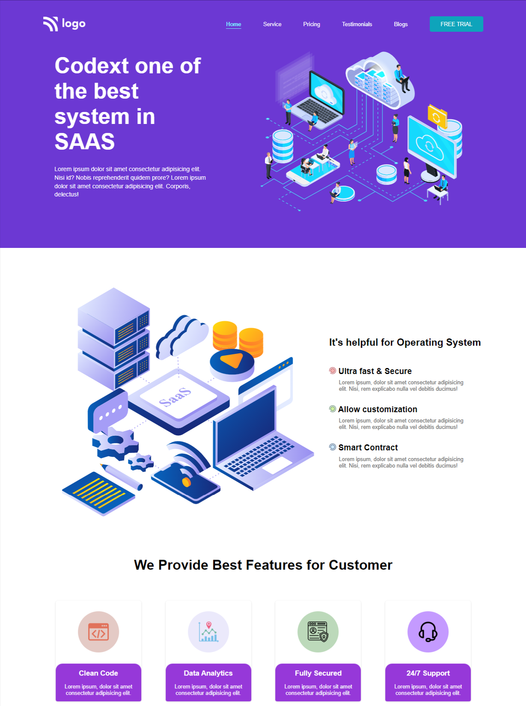

# Project_13 - HTML  and CSS 

---

## Project 13 [Live Link](https://project-13-themohitgupta.netlify.app)

---
## What I learned from this Project?

- Learnd about **cards**.
- Learnd about **svg image**.
- Learnd about **customizing svg fill color**.
- Learnd about create and use **css variables**.

---

### This Project took me around **2 hours** to complete.

---

---
